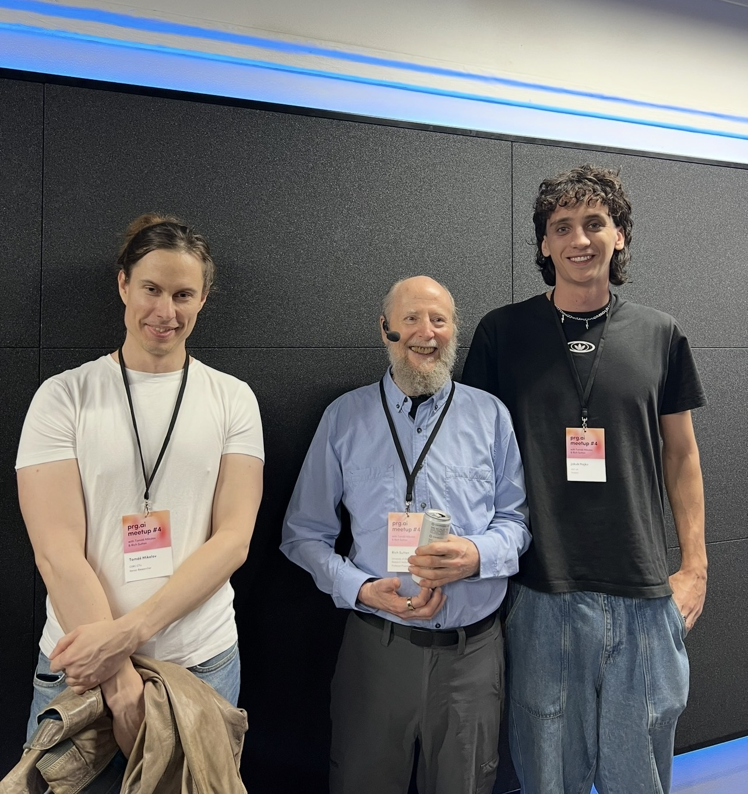

# Pure NumPy Word2Vec 

**Author:** Jakub Hajko  
**Target:** JetBrains Internship Assignment

A minimalist, from-scratch implementation of the Word2Vec algorithm (Skip-Gram with Negative Sampling) using only pure NumPy. Built with modularity in mind, the architecture intentionally mirrors modern deep learning frameworks (like PyTorch) to provide clean separation of data loading, model definition, and optimization logic.

---

## 🚀 Quick Start / Reproducibility

To avoid `sys.path` hell, this project is designed to be installed as an editable package. This allows you to import `word2vec` from anywhere in the environment.

### Option 1: Using `uv` (Recommended)
```bash
# 1. Clone the repository
git clone <your-repo-link>
cd <repo-folder>

# 2. Sync dependencies and create environment automatically
uv sync

# 3. Activate the environment
source .venv/bin/activate  # On Windows: .venv\Scripts\activate
```

### Option 2: Using standard `pip`
```bash
# 1. Clone the repository
git clone <your-repo-link>
cd <repo-folder>

# 2. Create and activate a virtual environment
python -m venv venv
source venv/bin/activate   # On Windows: venv\Scripts\activate

# 3. Install dependencies and the package in editable mode
pip install -r requirements.txt
pip install -e .
```

### Running the Experiments
Once installed, the easiest way to test the implementation is via the provided scripts. Data downloading, vocabulary building, and folder creation are handled automatically.

```bash
# Run the full pipeline with visualization (PCA 3D plot of embeddings)
python scripts/run_demo.py --size medium --epochs 3

# Run a stripped-down, bare-bones training loop
python scripts/simple_train.py
```

---

## 🧠 Design & Implementation Choices

The goal was to keep the codebase lightweight without sacrificing the core optimizations that make Word2Vec viable.

* **Algorithm:** Skip-Gram with Negative Sampling (SGNS). Instead of predicting a target word from its context (CBOW), we predict the context from a target word.
* **Negative Sampling:** Instead of an expensive softmax over the entire 10,000+ word vocabulary, we convert the problem into binary classification (distinguishing true context words from noise).
* **Frequent Word Subsampling:** Implemented Mikolov's heuristic to probabilistically drop highly frequent words (like "the", "a"). This drastically speeds up training and improves the learned representations of rare words.
* **Gradient Accumulation (`np.subtract.at`):** A critical NumPy-specific optimization. If a word appears multiple times in the same batch, standard indexing (`W[idx] -= grad`) overwrites updates. Using `np.subtract.at` ensures gradients are properly accumulated.
* **Dataset:** `text8` (Wikipedia dump). It is clean, readily available, and large enough to yield meaningful embeddings while remaining manageable for CPU training.

---

## 🏗️ Architecture & Abstractions

The project is structured into modular components, heavily inspired by PyTorch's abstractions.

```text
.
├── src/word2vec/
│   ├── config.py       # Global paths and experiment constants
│   ├── dataset.py      # Subsampling, negative distribution, and batch generation
│   ├── model.py        # SGNSModel: Forward pass, caching, and backward pass
│   ├── optim.py        # SGD Optimizer: Parameter updates
│   ├── pipeline.py     # High-level wrapper for inference (similarity, get_vector)
│   ├── trainer.py      # Standard training loop abstraction
│   ├── utils.py        # Dataset downloading and 3D PCA visualization
│   └── vocab.py        # Tokenization, <UNK> routing, and frequency counting
├── scripts/
│   ├── run_demo.py     # End-to-end CLI experiment runner
│   └── simple_train.py # Bare minimum code to train a model
├── notebooks/
│   └── demo.ipynb      # Interactive Jupyter version of the pipeline
├── data/               # Auto-generated: Raw downloaded datasets
└── saved_models/       # Auto-generated: Serialized model weights and vocab
```

* **`Word2VecDataset`:** Acts like a PyTorch `DataLoader`. It yields batches of `(centers, contexts, negatives)`.
* **`SGNSModel`:** Contains weights `W_in` (target vectors) and `W_out` (context vectors). It implements `forward()` to compute loss and caches intermediate values, followed by `backward()` to return gradients.
* **`Trainer` & `SGD`:** The trainer handles the standard `forward -> backward -> step` loop, while the optimizer applies the learning rate and updates the weights.

---

## 📐 Mathematical Foundations

Understanding the backward pass requires deriving the gradients of the Negative Sampling loss function. 

### The Objective
For a single center word `c`, a positive context word `p`, and `K` negative samples `n_k`, the binary cross-entropy loss `L` is:

`L = -log(sigma(v_c * v_p)) - sum(log(1 - sigma(v_c * v_n_k)))`

Where:
* `v_c` is the embedding of the center word (`W_in`).
* `v_p` is the embedding of the true context word (`W_out`).
* `v_n_k` are the embeddings of the negative samples (`W_out`).
* `sigma(x)` is the sigmoid function.

### The Gradients
Taking the derivative of the loss with respect to the dot products (logits), we get elegant, simple error terms:

* **Positive Error:** `dL/d(v_c * v_p) = sigma(v_c * v_p) - 1`
* **Negative Error:** `dL/d(v_c * v_n_k) = sigma(v_c * v_n_k) - 0`

Using the chain rule, we distribute these errors back to the respective embedding matrices:

**1. Gradient for the positive context vector (`v_p`):**
`dL/dv_p = (sigma(v_c * v_p) - 1) * v_c`

**2. Gradient for the negative context vectors (`v_n_k`):**
`dL/dv_n_k = sigma(v_c * v_n_k) * v_c`

**3. Gradient for the center vector (`v_c`):**
`dL/dv_c = (sigma(v_c * v_p) - 1) * v_p + sum(sigma(v_c * v_n_k) * v_n_k)`

*(These formulas are exactly what powers the matrix multiplications and `einsum` operations inside `model.py`'s `backward()` method).*

---

## 🌍 Small World

Word2Vec changed the paradigm of NLP, moving the field from sparse representations to dense semantic spaces. I recently had the incredible opportunity to meet Tomas Mikolov—the creator of Word2Vec—along with Richard S. Sutton, often called the grandfather of reinforcement learning, at the Prague Days of AI.



*Reference:* [Distributed Representations of Words and Phrases and their Compositionality (Mikolov et al., 2013)](https://arxiv.org/abs/1310.4546)